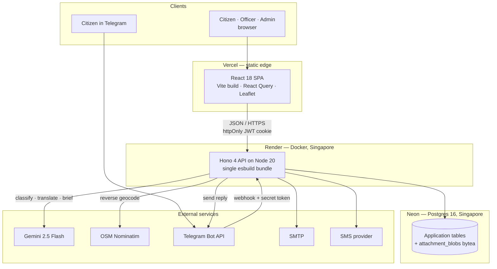
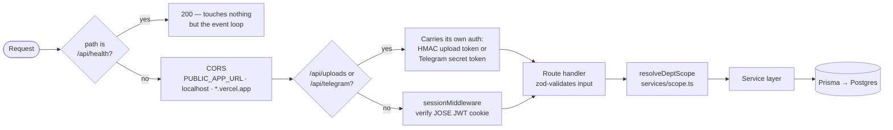
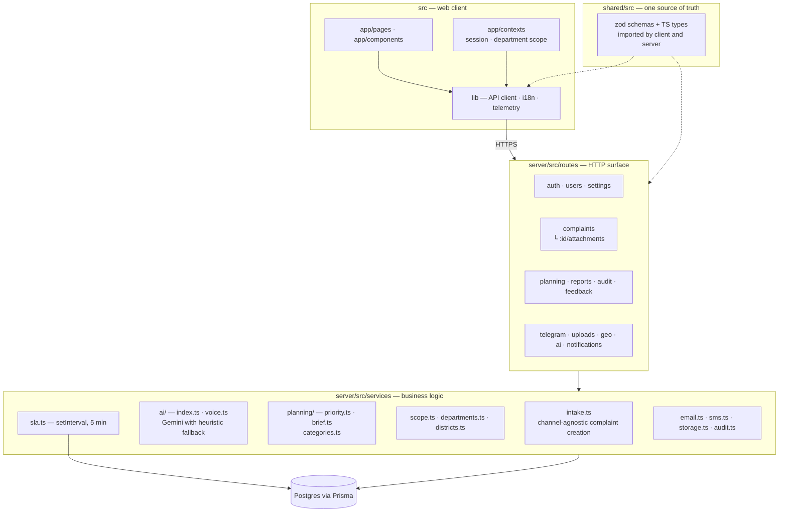
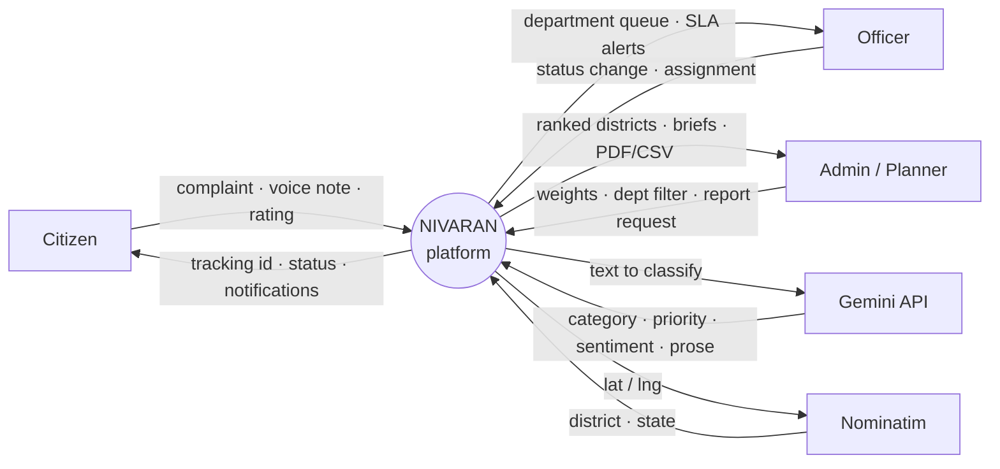
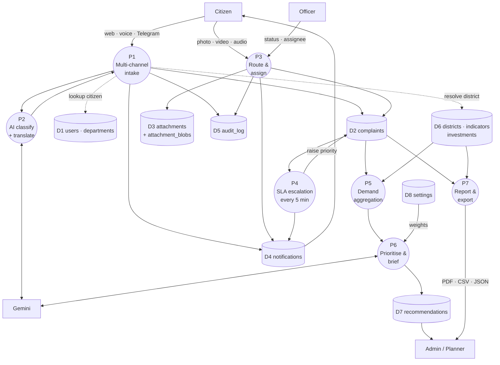
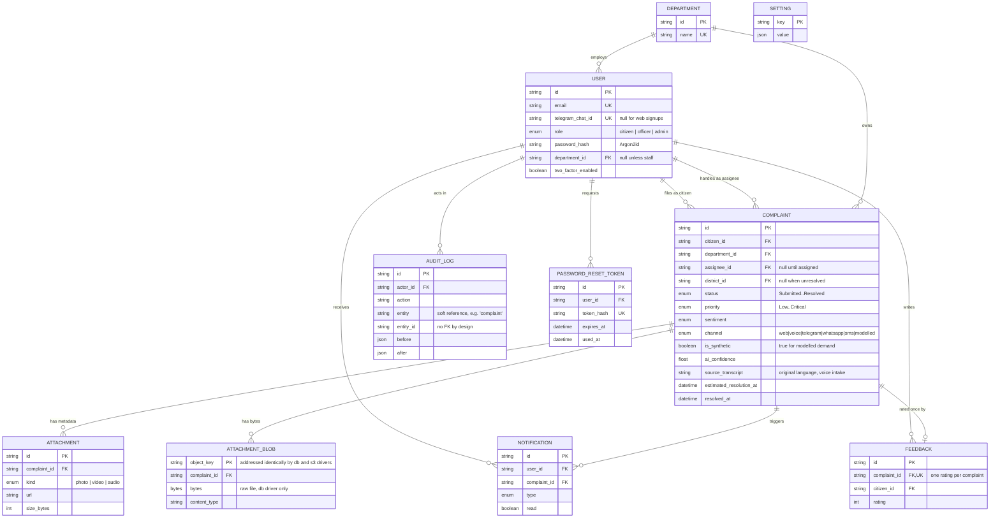
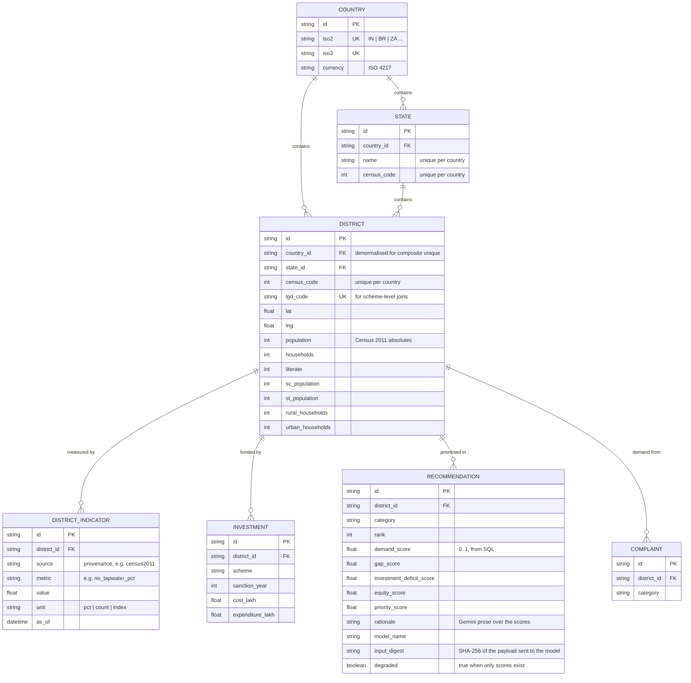

# NIVARAN — Citizen Grievance Platform & National Demand Intelligence

NIVARAN is an AI-assisted civic-grievance platform. Citizens file complaints in any of 11 Indian languages, attach photos / videos / audio, drop a pin on the map, and watch the status. Officers and admins triage, assign, escalate, and resolve from a separate console with analytics, heatmaps, audit logs, and exportable reports.

On top of that intake layer sits a **national demand-intelligence layer**: citizen
requests are aggregated to district level, joined against Census 2011 demographic
and household-amenity data, and ranked to surface where infrastructure investment
is most needed. Gemini writes the policy rationale over figures that SQL computes,
so every number a policymaker sees is traceable and reproducible.

The whole stack runs locally with two commands. No paid services required.

## Project history and hackathon disclosure

This repository is **not** a from-scratch hackathon build, and the commit history
says so plainly. Being explicit about it:

- **Pre-existing (first commit 2026-07-08 through commit `1226099`).** The
  citizen grievance portal, admin console, authentication, Prisma schema, Gemini
  complaint classification, attachments, 11-language UI, Leaflet heatmap, SLA
  escalation, audit log, PDF/CSV reports, Docker setup, and CI. All of it
  predates the challenge and is verifiable in this repository's commit history up
  to and including `1226099`.
- **Built for this challenge.** The district geography model, ingest of real
  Census 2011 district data, the deterministic district prioritisation engine, the
  grounded Gemini policy-briefing layer, the national planning console, and
  voice-first intake via Gemini multimodal audio.

Everything in the second list is what converts a municipal complaint tracker into
a national planning tool, and it is where the challenge-specific work sits. See
[ATTRIBUTIONS.md](ATTRIBUTIONS.md) for third-party code and dataset citations, and
the synthetic-data disclosure.

### A note on the demand data

District-level demand volumes in the demo are **synthetic**, generated and
weighted by real Census 2011 deprivation figures so that hotspots land on genuine
infrastructure gaps. They are flagged in the database and badged in the UI. Real
complaints filed through the app are stored unflagged and stay distinguishable.
Nivaran has no access to real national grievance microdata; CPGRAMS publishes
only aggregate monthly PDFs.

## Stack

| Layer | Tech |
| --- | --- |
| Web client | Vite 6, React 18, TypeScript 5, Tailwind 4, shadcn/ui, React Query, react-hook-form + zod, react-i18next, Leaflet |
| Backend | Hono 4 on Node 20, TypeScript, Argon2id, JOSE JWT cookies, Prisma 5 |
| Database | Postgres 16 |
| Attachment storage | Postgres `bytea` by default (`STORAGE_DRIVER=db`), S3/MinIO driver available (`STORAGE_DRIVER=s3`) |
| AI | Gemini 2.5 Flash (default) with heuristic offline fallback |
| Email | Nodemailer SMTP — Mailtrap / Resend / Brevo / Gmail App Password all work, dev mode logs to stdout |
| SMS | Twilio / MSG91 ready, dev mode logs to stdout |
| Tests | Vitest + Testing Library |
| CI | GitHub Actions (typecheck, build, test) |
| Maps | OpenStreetMap tiles |
| Telemetry | PostHog (opt-in) — falls back to console |

## Quick start

```cmd
git clone <your-fork-url>
cd <repo>

docker compose up -d

npm install
npm --prefix shared install
npm --prefix server install

copy server\.env.example server\.env
REM Edit server\.env and add your GEMINI_API_KEY (from Google AI Studio)
npm --prefix server run prisma:generate
npm --prefix server run prisma:migrate
npm --prefix server run db:seed

npm run dev:all
```

Wait for both servers to log "ready". Then visit:

- **Citizen portal** — http://localhost:5173/login
- **Admin console** — http://localhost:5173/admin/login
- **MinIO console** — http://localhost:9001 (`nivaran` / `nivaran-dev-only`)

The single `npm run dev:all` script starts the Vite client and the API server side-by-side via `concurrently`. If you close the terminal, both stop.

## Demo accounts (seeded by `db:seed`)

| Role | Email | Password |
| --- | --- | --- |
| Citizen | `citizen@demo.nivaran.in` | `Citizen@2026` |
| Officer | `officer.public@demo.nivaran.in` | `Officer@2026` |
| Admin | `admin@demo.nivaran.in` | `Admin@2026` |

Officers are department-scoped — they only see complaints assigned to their department. Invite them from the Admin console → Users page and assign a department. See [DEMO_ACCOUNTS.md](DEMO_ACCOUNTS.md) for more details.

## Features

### National demand intelligence (`/admin/planning`)

The planning layer aggregates citizen demand to district level and ranks where
infrastructure investment is most warranted.

- **640 districts, real data.** Census of India 2011 district tables ingested into
  ten deprivation indicators — water, electricity, sanitation, open defecation,
  internet, housing condition, literacy, SC/ST share, rurality — all oriented so
  higher always means worse.
- **Deterministic scoring.** A composite of demand intensity (complaints per
  100,000 households), measured infrastructure gap, investment deficit, and
  equity. Computed arithmetically in SQL, unit-tested, and reproducible: the same
  inputs always produce the same ranking.
- **Adjustable weighting.** The four components are exposed as sliders, because
  the weighting is a policy judgement rather than a fact. Changing it visibly
  reorders the ranking.
- **Grounded Gemini briefings.** Gemini receives the finished table and writes the
  rationale, proposed interventions, and risks. It never produces a number: the
  response schema has no numeric fields, every row stores a SHA-256 of the exact
  figures the model saw, and the generated prose is scanned for numerals that were
  not supplied. Exportable as a PDF with a provenance footer.
- **Honest about gaps.** Proxy measures are labelled wherever they appear.
  Unavailable components render as "no data", never as zero, and their weight is
  redistributed rather than silently deflating every score.

Validation worth noting: the top-ranked districts come out as the north Bihar
belt plus Nabarangapur, Malkangiri, Simdega, Khunti and Shrawasti. Several are
NITI Aayog Aspirational Districts, which the system was never told about.

### Voice-first intake

- Record a complaint in any Indian language. One Gemini call transcribes it in the
  language spoken, identifies that language, translates to English, and classifies
  it.
- The **original-language transcript is stored alongside the translation**, so an
  officer can check the translation rather than trust it.
- Recordings are converted to 16 kHz mono WAV in the browser before upload, since
  `MediaRecorder` produces webm and webm is not a documented Gemini audio format.
- Needs no Google Cloud billing — only the AI Studio key. Falls back to manual
  entry on any failure.

### Citizen portal
- Sign up, login, password reset, profile, password change
- File a complaint with title, description, category, language (11 languages: EN, HI, TA, TE, KN, ML, MR, BN, GU, PA, UR)
- AI-assisted classification: category, department, priority, sentiment, summary, powered by Gemini 2.5 Flash
- Photo / video / audio attachments, uploaded straight from the browser against an HMAC-signed upload token (`STORAGE_DRIVER=db` keeps bytes in Postgres; `s3` swaps in presigned S3/MinIO URLs)
- Live audio recording via MediaRecorder API
- Geolocation pin drop ("Use my location"), reverse-geocoded server-side to `18.5204, 73.8567 — Kasba Peth, Pune, Maharashtra`
- Track any complaint by ID with a step-by-step status timeline
- Real-time notifications with unread badge and "Mark all as read"
- Streaming AI assistant chatbot powered by Gemini, with complaint-aware responses
- Star rating + comment feedback on resolved complaints

### Admin console
- Department-scoped dashboard, complaints list, analytics, escalation, heatmap, reports
- AI-generated analytics reports using Gemini to summarize complaint patterns and surface actionable insights
- Complaint detail modal with status / priority / assignee / escalate / resolve actions
- Leaflet heatmap with category-coloured markers
- SLA scheduler that auto-escalates overdue complaints every 5 minutes
- Settings page with persistent storage (notifications, escalation thresholds, AI flags)
- JSON / CSV / PDF reports via `/api/reports`
- User & role management (invite officers, assign departments, toggle roles) — admin only
- Audit log with CSV export — every mutation is recorded
- Feedback analytics (avg rating, distribution, by category, recent comments)

### Officer console
- Department-scoped view — officers only see complaints routed to their department
- Update complaint status, priority, and add resolution notes
- Escalate complaints up to admin when needed
- Receive email / SMS notifications on new assignments

### Gemini-powered features
- **AI Complaint Triage** — every submitted complaint is analyzed by Gemini to generate priority, severity, and a summary for the assigned officer dashboard.
- **Gemini Chat Assistant** — answers how to use the platform, explains how to file complaints, and rewrites informal problem descriptions into properly worded formal complaints.
- **Translation layer** — the chatbot can respond in any language on request, and complaint reports are auto-translated for officers who do not share the citizen's filing language.

### Cross-cutting
- Hard auth: bfcache-aware logout, role-gated routes, sealed-room navigation (signed-in users can't see login pages, signed-out can't reach protected ones)
- Mobile-friendly: hamburger drawer below 1024px, responsive grids, no horizontal scroll on phones
- Email + SMS notifications (gated by admin toggle)
- Opt-in telemetry banner (PostHog-ready, console by default)
- Dockerfile + GitHub Actions CI

## Architecture

All diagrams below are Mermaid, so they render inline on GitHub. Every box
corresponds to code in this repository — file names are given where useful.

### 1. Deployment architecture

Three managed services, deliberately in the same region. Render and Neon are
both in Singapore (`ap-southeast-1`) because a cross-region hop on every query
costs more than the free tier saves.



Two things in here are load-bearing rather than incidental. Attachment bytes
live in Postgres by default, so uploads work on a deployment with nothing but a
database — an unconfigured S3 bucket fails in a way that looks like a broken
app rather than missing configuration. And every external service degrades
instead of failing: Gemini falls back to a deterministic heuristic classifier,
SMTP and SMS log to stdout when unconfigured.

### 2. Request lifecycle

Middleware order is a design decision here, not a default. Each branch exists
because something broke without it.



`/api/health` is mounted before everything so that "the process is dead" and
"the database is dead" cannot look identical from outside — otherwise a
platform health check recycles a perfectly healthy container whose database is
unreachable. `/api/ready` answers the database question separately, and also
reports the running commit and process uptime.

`/api/uploads` and `/api/telegram` sit ahead of the session middleware because
neither has a session: the upload PUT carries a signed token, and Telegram
authenticates with the secret it echoes on every update.

`resolveDeptScope` is the authorisation boundary. An officer is pinned to their
own department and the `?dept=` parameter is ignored for them; an officer with
no department is shown nothing rather than everything. It lives in one function
because copying that rule into five handlers is how one of them ends up
trusting `?dept=`.

### 3. System design — module map



The shape that matters most is `intake.ts`. Classify, route to a department,
resolve a district, persist, notify, audit — that sequence used to live inline
in `POST /api/complaints`, which meant a second channel would either duplicate
it or silently skip parts. A Telegram complaint that missed district resolution
would still appear in national counters while being invisible to the planning
layer: a bug that never throws. Every channel now calls one function, so adding
WhatsApp is an adapter, not a second implementation.

### 4. Data flow diagram — Level 0 (context)



### 5. Data flow diagram — Level 1 (processes)

Rectangles are external entities, circles are processes, cylinders are data
stores.



The separation between P5/P6 and Gemini is the important one. Every score in
P5 and P6 is computed in SQL from D2, D6 and D8. Gemini reads those computed
aggregates and writes prose about them; it never produces a number. Each
`recommendation` row stores the model name and a SHA-256 digest of the exact
aggregate payload sent to the model, so any sentence can be traced back to the
figures that produced it, and a stale narrative is detectable.

### 6. ER diagram — grievance core

Key columns only; see [`server/prisma/schema.prisma`](server/prisma/schema.prisma)
for the full definition.



`AUDIT_LOG` deliberately has no foreign key to `COMPLAINT`. It records
`entity` + `entity_id` as a soft reference so it can log any entity type, and
so a deleted row cannot cascade away its own audit trail. The cost is that
department-scoped audit queries need a raw SQL join on `lower(entity)`.

`SETTING` is intentionally unconnected — a single key/value table holding the
admin toggles and the planning weights.

### 7. ER diagram — national planning layer

Joined to the grievance core at `DISTRICT ||--o{ COMPLAINT`, which is what
turns individual grievances into district-level demand.



Three schema choices here are worth calling out, because each one was a
correction of something that did not work:

`DISTRICT_INDICATOR` is tall, not wide. A wide table needs a migration for
every new indicator; this shape absorbs a new dataset — SDG index, air quality,
scheme coverage — without touching the schema. Every row carries its `source`,
so no figure is untraceable.

Uniqueness on `STATE.name`, `STATE.census_code` and `DISTRICT.census_code` is
scoped **per country**. Those three constraints were global, which meant a
Brazilian municipality code of 1 would have collided with Indian census
district 1 — a second country was impossible however generic the rest of the
model looked. `DISTRICT.country_id` is denormalised from its state precisely
because a composite unique constraint cannot reach through a relation.

`DISTRICT` holds the published Census absolutes — population, households,
literate, SC/ST counts. The ten derived percentages (`no_tapwater_pct`,
`illiteracy_pct`, `rural_household_share_pct` and seven others) are computed at
ingest and written to `DISTRICT_INDICATOR` with their `source` recorded. Keeping
the raw counts on the district row means every percentage stays checkable
against the published tables instead of being the only surviving copy of the
figure. 640 districts × 10 metrics is the 6,400 indicator rows.

The default priority weights are demand `0.35`, gap `0.30`, investment `0.20`,
equity `0.15`, overridable from the admin console and persisted in `SETTING`.
The investment component has no data nationwide, and the scoring handles that by
**renormalising the weights across the components that do** — not by
substituting zero, which would score an unmeasured district as though no money
had ever been spent there. Renormalising is also what keeps a priority score
meaning "0..1"; simply dropping the term would deflate every district by the
missing weight.

One wart is visible in the ER diagram above:
`RECOMMENDATION.investment_deficit_score` is a non-null column, so a null
computed score is persisted as `0`. The `degraded` flag and the upstream
`componentsUsed` list carry the real "unknown" signal, and the UI draws a
hatched "no data" bar rather than an empty one. See the comment block in
[`server/src/services/planning/priority.ts`](server/src/services/planning/priority.ts)
for the four data sources attempted and why each was rejected.

## Project layout
.
├── server/ # Hono API + Prisma
│ ├── src/ # Routes, services, auth
│ ├── prisma/ # Schema, migrations, seed, backfill
│ └── Dockerfile
├── shared/ # zod schemas + TS types reused by client and server
│ └── src/
├── src/ # Web client (Vite + React)
│ ├── app/ # Pages, layouts, contexts, components
│ ├── lib/ # Telemetry, API client, i18n, helpers
│ └── styles/
├── docker-compose.yml # Postgres + MinIO
├── .github/workflows/ci.yml
└── docs/operations.md # Env vars, migrations, backups, ops checklist

## Configuration

All server config lives in `server/.env`. Defaults match the local Docker stack — copy from `server/.env.example` and you're done. Optional knobs:

| Var | Default | Effect |
| --- | --- | --- |
| `AI_PROVIDER` | `gemini` | Use Gemini by default, with fallback to heuristic mode if needed. |
| `GEMINI_API_KEY` | _unset_ | Required when `AI_PROVIDER=gemini`. Get it from [aistudio.google.com](https://aistudio.google.com). |
| `OPENAI_API_KEY` | _unset_ | Required when `AI_PROVIDER=openai`. |
| `SMTP_HOST` | _unset_ | When unset, every email is logged to stdout. |
| `SMS_PROVIDER` | `console` | Logs to stdout. Switch to `twilio` / `msg91` / `sns` once you wire up keys. |
| `S3_*` | MinIO defaults | Repoint to Cloudflare R2 (10 GB free) or AWS S3 in production. |

Full list with explanations is in [`docs/operations.md`](docs/operations.md).

## Available scripts

```cmd
npm run dev          REM Web client only
npm run dev:server   REM API server only
npm run dev:all      REM Both, recommended
npm run build        REM Web client production build
npm test             REM Vitest suite (23 tests)
npm run db:backup    REM Snapshot dev Postgres to ./backups
npm run db:restore   REM Restore a dump: -- backups/nivaran-<stamp>.dump
```

Server-only scripts (run with `npm --prefix server run <name>`):
prisma:generate REM Regenerate Prisma client after schema changes
prisma:migrate REM Apply pending migrations
prisma:studio REM Visual DB browser at localhost:5555
db:seed REM Insert demo users + departments
seed:citizen REM Give the demo citizen a realistic 20-complaint history (idempotent)
db:reset REM Drop and re-create the database (destructive — run npm run db:backup first)
backfill:ai REM Re-run AI classifier on every existing complaint
ingest:census REM Load Census 2011 district data (640 districts, 6,400 indicators)
ingest:demand REM Generate the modelled district demand corpus
planning:briefs REM Pre-generate Gemini policy briefings for the top-ranked districts
typecheck REM Type-check src/ (no output — tsc never emits here)
typecheck:scripts REM Type-check prisma/ and scripts/
build REM Bundle the server to dist/server.js with esbuild
start REM Run the bundled server

To bring the planning layer up from an empty database:

```cmd
npm --prefix server run db:seed
npm --prefix server run ingest:census
npm --prefix server run ingest:demand
npm --prefix server run seed:citizen
npm --prefix server run planning:briefs -- --limit 25
```

Note the difference between the last two data steps. `ingest:demand` generates the
~150,000-row modelled corpus that makes district hotspots measurable; those rows
are flagged and disclosed as modelled. `seed:citizen` writes twenty individually
authored complaints onto the demo citizen account so the citizen portal has a
believable history — varied categories, a realistic status funnel, resolution
times, star ratings, and two dictated in Marathi and Hindi. They are demo fixtures
for a demo account, not modelled demand, and are not flagged as synthetic.

The census ingest downloads its source CSV on first run and caches it locally, so
every run after the first works offline. See
[server/prisma/ingest/README.md](server/prisma/ingest/README.md) for what each
dataset contributes and how the modelled demand is weighted.

**On the Gemini free tier**, `planning:briefs` will consume most of a day's quota
(20 `generateContent` requests per day). Rows it cannot narrate are still written
with correct scores and marked degraded, and the planning screen renders them
without prose — so the ranking never depends on the model being available.

## How the AI is wired

Two distinct roles, deliberately separated:

| | Scoring and ranking | Narrative |
| --- | --- | --- |
| Produced by | SQL and arithmetic over database rows | Gemini 2.5 Flash |
| Reproducible | Yes — pure function, unit-tested | No |
| Can emit numbers | Yes, it computes them | **No, by construction** |
| On failure | n/a | Row persists with scores, marked degraded |

Gemini also handles complaint classification (with a hand-written heuristic
classifier as an offline fallback), the citizen chat assistant, and voice
transcription. Nothing in the grievance workflow blocks on it.

## Demo

[docs/DEMO.md](docs/DEMO.md) is a three-minute walkthrough, including what to
check beforehand and what to say if the Gemini quota is exhausted mid-demo.

## Cost reality

Everything in this README runs on the free path. No credit card required.

| Component | Default | Free option | Paid path |
| --- | --- | --- | --- |
| Database | Postgres in Docker | ✅ | Supabase / Neon / RDS |
| Object storage | MinIO in Docker | ✅ | Cloudflare R2 (10 GB free) → AWS S3 |
| AI classifier | Gemini 2.5 Flash (default) | ✅ | OpenAI gpt-4o-mini (~95%) at $0.000015/call |
| Email | Console logger | ✅ | Resend (3k/mo free) / Mailtrap / Gmail App Password |
| SMS | Console logger | ✅ | Twilio / MSG91 (paid per message in India) |
| Maps | OpenStreetMap tiles | ✅ | Mapbox / Google (paid) |
| Hosting | localhost | ✅ | Fly.io / Railway / Render / your own VPS |

## Documentation

- [`docs/operations.md`](docs/operations.md) — env vars, migrations, backups, production checklist
- [`DEMO_ACCOUNTS.md`](DEMO_ACCOUNTS.md) — credentials, role behaviours, how to invite staff

## Tests

```cmd
npm test
```

23 tests across 3 suites:
- Badge color helpers
- Server-side complaint serializer (Prisma↔wire round-trip)
- AI heuristic classifier (routing, priority, sentiment, stemming, Hinglish keywords, negation)

CI runs them on every push and PR. See [`.github/workflows/ci.yml`](.github/workflows/ci.yml).

## License

Copyright (c) 2026 Nivaran. All rights reserved.

This source code is made available for viewing purposes only.
Copying, modification, distribution, or use of any kind is not permitted
without explicit written permission from the author.