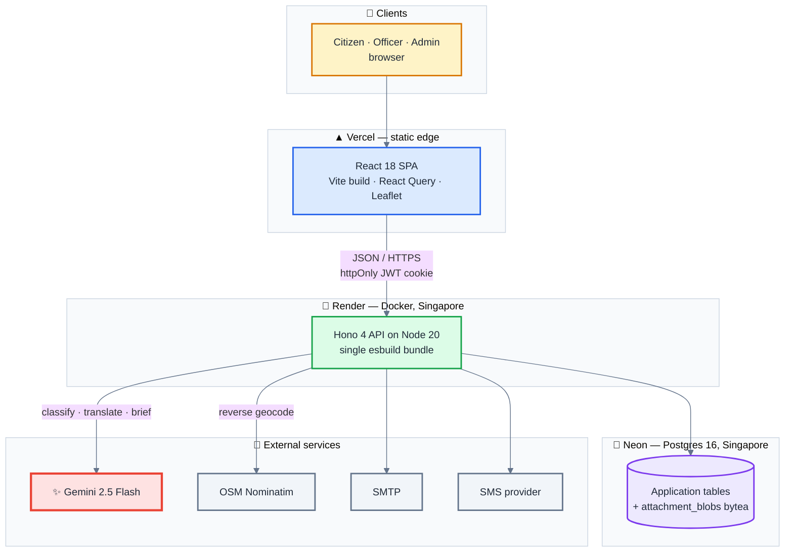
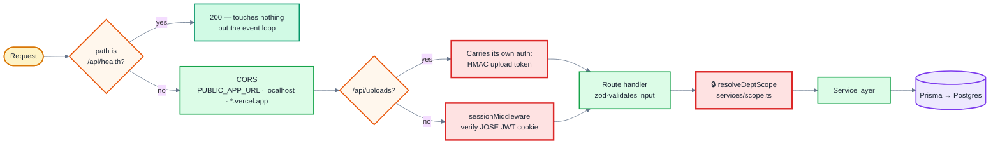
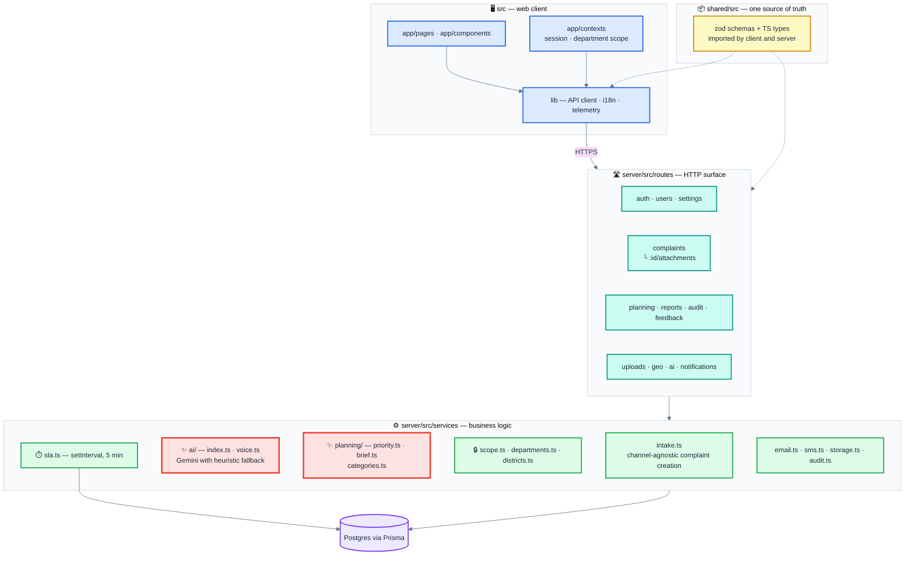
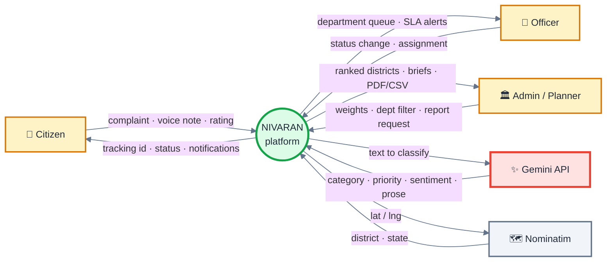
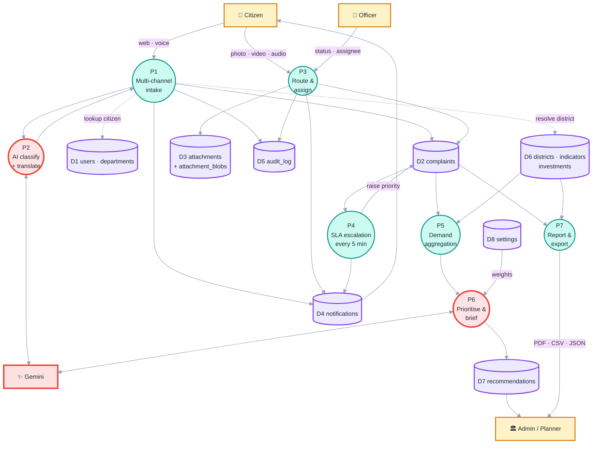
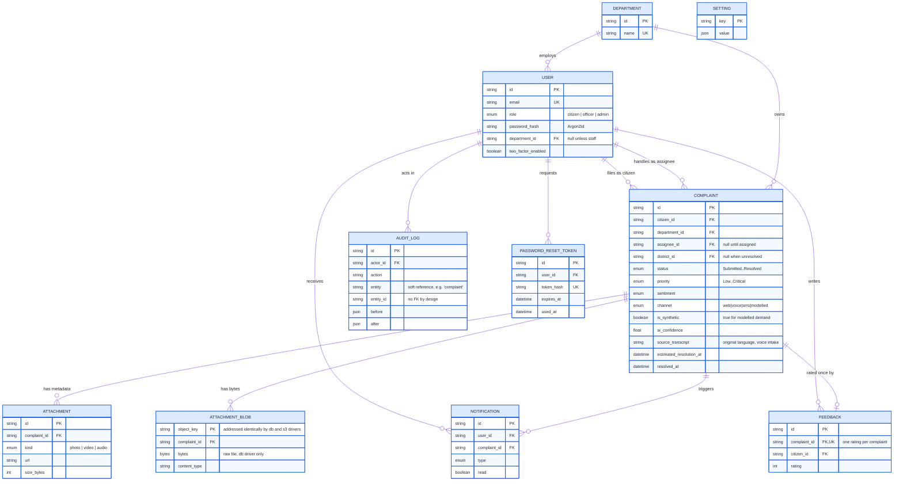
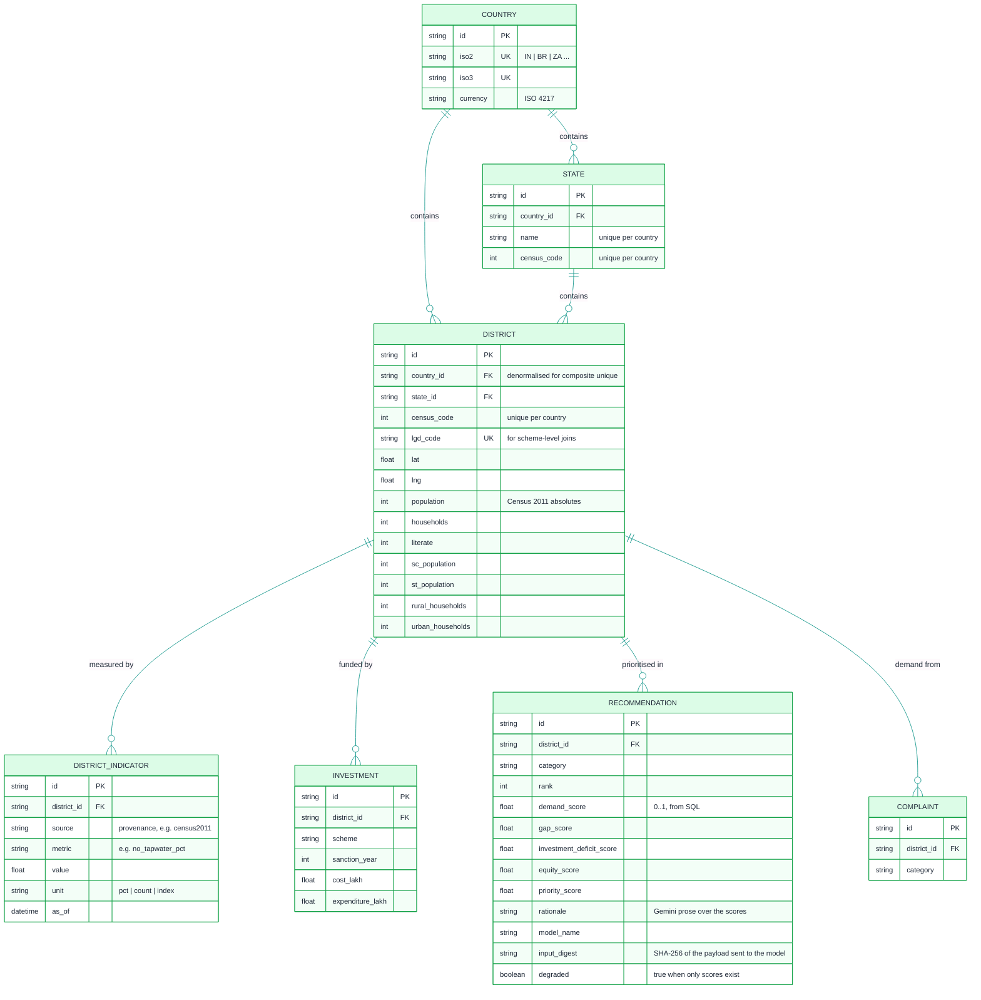

<div align="center">

# 🇮🇳 NIVARAN

### Citizen Grievance Platform & National Demand Intelligence

**From "my street light is broken" to "here is where the next rupee should go."**

[](https://ai.google.dev/)
[](https://aistudio.google.com)
[](https://www.typescriptlang.org/)
[](https://react.dev/)
[](https://hono.dev/)
[](https://www.postgresql.org/)
[](https://www.prisma.io/)
[](https://www.docker.com/)


[Problem](#-the-problem) • [Solution](#-the-solution) • [Features](#-features) • [Setup](#-quick-start) • [Architecture](#-architecture) • [API](#-api-reference)

</div>

---

## 📋 Table of Contents

- [What Is Nivaran](#-what-is-nivaran)
- [The Problem](#-the-problem)
- [The Solution](#-the-solution)
- [Project History & Hackathon Disclosure](#-project-history-and-hackathon-disclosure)
- [Tech Stack](#-stack)
- [Google Technology Used](#-google-technology-used)
- [Quick Start](#-quick-start)
- [Demo Accounts](#-demo-accounts)
- [Key Features](#-features)
- [Architecture](#-architecture)
- [Project Layout](#-project-layout)
- [API Reference](#-api-reference)
- [Configuration](#-configuration)
- [Available Scripts](#-available-scripts)
- [How the AI is Wired](#-how-the-ai-is-wired)
- [Demo](#-demo)
- [Cost Reality](#-cost-reality)
- [Documentation](#-documentation)
- [Tests](#-tests)
- [Team](#-team)
- [Acknowledgments](#-acknowledgments)
- [License](#-license)

---

## 🎯 What Is Nivaran
NIVARAN is an AI-assisted civic-grievance platform. Citizens file complaints in any of 11 Indian languages, attach photos / videos / audio, drop a pin on the map, and watch the status. Officers and admins triage, assign, escalate, and resolve from a separate console with analytics, heatmaps, audit logs, and exportable reports.

On top of that intake layer sits a **national demand-intelligence layer**: citizen
requests are aggregated to district level, joined against Census 2011 demographic
and household-amenity data, and ranked to surface where infrastructure investment
is most needed. Gemini writes the policy rationale over figures that SQL computes,
so every number a policymaker sees is traceable and reproducible.

The whole stack runs locally with two commands. No paid services required.

---

## 🔴 The Problem

Municipal civic grievance resolution in India faces systemic bottlenecks across three core dimensions:

- **👥 For Citizens**: Language barriers, complex portals, lack of transparency, and no simple way to report issues via voice or multilingual text.
- **🏛️ For Government Officers**: Unstructured complaints, lack of automatic category & priority triage, manual routing overhead, and departmental silos.
- **🗺️ For Policymakers & Planners**: Grievance data remains locked in isolated ticket logs rather than informing national infrastructure budgets. Capital allocations often miss the districts with the greatest measured infrastructure gaps and census-backed deprivation.

---

## ✅ The Solution

NIVARAN bridges the gap between everyday citizen complaints and national budget planning through an integrated two-tier architecture:

1. **Multimodal Citizen Intake**: AI-assisted voice and text reporting in 11 Indian languages with automatic transcription, translation, geocoding, and department classification.
2. **Departmental Operations Firewall**: Role-gated dashboard for officers with automatic SLA escalation, audit trails, resolution tracking, and heatmap visualization.
3. **National Demand Intelligence Layer**: District-level aggregate analysis uniting citizen grievances with Census 2011 demographic indicators (640 districts, 6,400 metrics) and generating reproducible, SQL-grounded Gemini policy rationale briefings.

---

## 📜 Project history and hackathon disclosure

> [!IMPORTANT]
> This repository is **not** a from-scratch hackathon build, and the commit
> history says so plainly. Everything below is verifiable with `git log`.

**🔵 Pre-existing — first commit 2026-07-08 through commit `1226099`.**
The citizen grievance portal, admin console, authentication, Prisma schema,
Gemini complaint classification, attachments, 11-language UI, Leaflet heatmap,
SLA escalation, audit log, PDF/CSV reports, Docker setup, and CI. All of it
predates the challenge.

**🟢 Built for this challenge — commits `1226099..HEAD`.**
This is what converts a municipal complaint tracker into a national planning
tool. Run `git log --oneline 1226099..HEAD` to see all 32 commits.

| Area | What was built | Commits |
| --- | --- | --- |
| 🗺️ **National planning layer** | District geography model + real Census 2011 ingest (640 districts, 6,400 indicators); deterministic 4-component district ranking; Gemini briefings grounded on SQL-computed aggregates; the `/admin/planning` console | `b5608e3` `6bb4e1a` `9112ac2` |
| 🎙️ **Multimodal intake** | Dictate a complaint in any Indian language via Gemini multimodal audio — one call transcribes, detects language, translates and classifies; real confidence reporting | `2a3ac90` `4d5bcd0` |
| 🌍 **Cross-border portability** | A `Country` dimension, and the three *global* unique constraints on state/district codes rescoped per country — the actual blocker to a second BRICS nation | `b42c588` `c4096b5` |
| 🔒 **Department firewall** | Per-department data isolation across Dashboard, Reports, Feedback, Audit, Users and Planning, resolved in one `resolveDeptScope` function because it is a security boundary | `9facbf5` `db0a007` `3a457c8` `def3091` `d0a70eb` |
| 📎 **Attachments without a bucket** | A Postgres `bytea` storage driver plus HMAC-signed upload tokens, so photo/video/audio uploads work on a free-tier deployment with no S3 account | `d1683e2` `e8ed35b` |
| 📍 **Location that reaches planning** | Server-side reverse geocoding, so "Use my location" yields `18.5204, 73.8567 — Kasba Peth, Pune, Maharashtra` and the complaint lands in a real district | `7b7abdb` `0babb18` |
| 📊 **Honest dashboards** | Totals computed in the database rather than from one cached page; server-side paging; working heatmap; reconciled counts across screens | `f21c603` `9a39f18` `5ffb97d` `82c43f5` |
| 🚀 **Deployability** | Liveness/readiness split so a dead database stops looking like a dead process; single-bundle boot that cut cold start from ~60s to 24s; mobile overflow fixes across all 16 routes | `5026ab1` `251a4ec` `654fabe` `bb5c62d` `2179825` `e68e1f4` |
| 📚 **Documentation** | Planning-layer docs, deploy guide, demo script, and the seven architecture diagrams below | `2bc6fb4` `81fa18d` |

See [ATTRIBUTIONS.md](ATTRIBUTIONS.md) for third-party code and dataset
citations.

### ⚠️ A note on the demand data

> [!WARNING]
> **District-level demand volumes in the demo are synthetic.** They are
> generated and weighted by real Census 2011 deprivation figures so hotspots
> land on genuine infrastructure gaps — but they are not real complaints.
> They carry `is_synthetic = true` in the database, `channel = 'modelled'`
> rather than `'web'`, and a badge in the UI. Complaints filed through the app
> are stored unflagged and stay distinguishable forever.
>
> Nivaran has no access to real national grievance microdata: CPGRAMS publishes
> only aggregate monthly PDFs.

## 🧱 Stack

| Layer | Tech |
| --- | --- |
| Web client | Vite 6, React 18, TypeScript 5, Tailwind 4, shadcn/ui, React Query, react-hook-form + zod, react-i18next, Leaflet |
| Backend | Hono 4 on Node 20, TypeScript, Argon2id, JOSE JWT cookies, Prisma 5 |
| Database | Postgres 16 |
| Attachment storage | Postgres `bytea` by default (`STORAGE_DRIVER=db`), S3/MinIO driver available (`STORAGE_DRIVER=s3`) |
| AI | Gemini 2.5 Flash (default) with heuristic offline fallback |
| Email | Nodemailer SMTP — Mailtrap / Resend / Brevo / Gmail App Password all work, dev mode logs to stdout |
| SMS | Twilio / MSG91 ready, dev mode logs to stdout |
| Tests | Vitest + Testing Library |
| CI | GitHub Actions (typecheck, build, test) |
| Maps | OpenStreetMap tiles |
| Telemetry | PostHog (opt-in) — falls back to console |

## ✨ Google Technology Used

Every AI feature in Nivaran runs on **Gemini 2.5 Flash**, called over the REST
API with a key from **Google AI Studio**. There is no SDK dependency and no
Google Cloud project — the URL is built in one place,
[`geminiUrl()`](server/src/services/ai/index.ts), so every call site shares the
same shape.

```
https://generativelanguage.googleapis.com/v1beta/models/gemini-2.5-flash:generateContent
```

| # | Capability | Where in this repo | API surface | What Gemini is asked to do |
| --- | --- | --- | --- | --- |
| 1 | **Complaint classification** | [`services/ai/index.ts`](server/src/services/ai/index.ts) → `makeGeminiService()` | `POST /api/ai/classify`, and inline on complaint create | Read free text, return category, department, priority, sentiment, a summary and the detected language |
| 2 | **Voice-first intake** | [`services/ai/voice.ts`](server/src/services/ai/voice.ts) | `POST /api/ai/voice` | One multimodal call on raw audio: transcribe in the language spoken, identify that language, translate to English, and draft a title/description/category |
| 3 | **Policy briefings** | [`services/planning/brief.ts`](server/src/services/planning/brief.ts) | `/api/planning/*` | Read SQL-computed district aggregates and write the rationale, interventions and risks — **prose only, never a number** |
| 4 | **AI assistant** | [`services/ai/index.ts`](server/src/services/ai/index.ts) → `geminiChatStream()` | `POST /api/ai/chat` | Complaint-aware chat, streamed to the browser as Server-Sent Events |

**How the calls are configured.** Requests 2 and 3 use
`temperature: 0` with `responseMimeType: 'application/json'`, because the same
figures should always yield the same reading and the response is parsed by a zod
schema rather than a human. Inline audio is capped at 8 MB before it is sent, so
an oversized recording fails with a clear message instead of an opaque API
error.

> [!TIP]
> **The grounding boundary is the important part.** Every score the planning
> engine produces is computed in SQL. Gemini reads those computed aggregates and
> writes prose about them; it is never asked to produce a figure. Each
> `recommendation` row stores the model name and a **SHA-256 digest of the exact
> payload** sent to the model, so any sentence can be traced back to the numbers
> behind it — and a stale narrative is detectable rather than invisible.

> [!NOTE]
> **It degrades instead of failing.** With no `GEMINI_API_KEY`, or when a call
> fails or quota runs out, the API falls back to a deterministic heuristic
> classifier (`[ai] Using heuristic classifier`) and the planning engine renders
> its scores with `degraded = true` and no narrative. A judge with no key still
> gets a working app.

### Google services deliberately *not* used

Being straight about the boundary, since "we used Google Cloud" is easy to
overclaim:

| Considered | Decision | Why |
| --- | --- | --- |
| Cloud Speech-to-Text | ❌ Not used | Requires a Google Cloud project with billing enabled even inside the free quota. Gemini multimodal audio needs only the AI Studio key, and collapses transcribe + language ID + translate + classify into **one** request instead of a four-service pipeline with four failure points |
| Cloud Translation API | ❌ Not used | Same billing requirement; the translation already happens inside call #2 |
| Google Maps Platform | ❌ Not used | OpenStreetMap tiles via Leaflet need no key and no card. Reverse geocoding goes through Nominatim, proxied server-side so the 1 req/sec policy is actually enforceable |
| Vertex AI | ➡️ Migration path | The same model is available on Vertex AI. That is the route if this needed VPC controls, data residency or a committed-use discount — not required at prototype scale |

## 🚀 Quick start

```cmd
git clone <your-fork-url>
cd <repo>

docker compose up -d

npm install
npm --prefix shared install
npm --prefix server install

copy server\.env.example server\.env
REM Edit server\.env and add your GEMINI_API_KEY (from Google AI Studio)
npm --prefix server run prisma:generate
npm --prefix server run prisma:migrate
npm --prefix server run db:seed

npm run dev:all
```

Wait for both servers to log "ready". Then visit:

- **Citizen portal** — http://localhost:5173/login
- **Admin console** — http://localhost:5173/admin/login
- **MinIO console** — http://localhost:9001 (`nivaran` / `nivaran-dev-only`)

The single `npm run dev:all` script starts the Vite client and the API server side-by-side via `concurrently`. If you close the terminal, both stop.

## 🔑 Demo accounts

| Role | Email | Password |
| --- | --- | --- |
| Citizen | `citizen@demo.nivaran.in` | `Citizen@2026` |
| Officer | `officer.public@demo.nivaran.in` | `Officer@2026` |
| Admin | `admin@demo.nivaran.in` | `Admin@2026` |

Officers are department-scoped — they only see complaints assigned to their department. Invite them from the Admin console → Users page and assign a department. See [DEMO_ACCOUNTS.md](DEMO_ACCOUNTS.md) for more details.

## 🎯 Features

### National demand intelligence (`/admin/planning`)

The planning layer aggregates citizen demand to district level and ranks where
infrastructure investment is most warranted.

- **640 districts, real data.** Census of India 2011 district tables ingested into
  ten deprivation indicators — water, electricity, sanitation, open defecation,
  internet, housing condition, literacy, SC/ST share, rurality — all oriented so
  higher always means worse.
- **Deterministic scoring.** A composite of demand intensity (complaints per
  100,000 households), measured infrastructure gap, investment deficit, and
  equity. Computed arithmetically in SQL, unit-tested, and reproducible: the same
  inputs always produce the same ranking.
- **Adjustable weighting.** The four components are exposed as sliders, because
  the weighting is a policy judgement rather than a fact. Changing it visibly
  reorders the ranking.
- **Grounded Gemini briefings.** Gemini receives the finished table and writes the
  rationale, proposed interventions, and risks. It never produces a number: the
  response schema has no numeric fields, every row stores a SHA-256 of the exact
  figures the model saw, and the generated prose is scanned for numerals that were
  not supplied. Exportable as a PDF with a provenance footer.
- **Honest about gaps.** Proxy measures are labelled wherever they appear.
  Unavailable components render as "no data", never as zero, and their weight is
  redistributed rather than silently deflating every score.

Validation worth noting: the top-ranked districts come out as the north Bihar
belt plus Nabarangapur, Malkangiri, Simdega, Khunti and Shrawasti. Several are
NITI Aayog Aspirational Districts, which the system was never told about.

### Voice-first intake

- Record a complaint in any Indian language. One Gemini call transcribes it in the
  language spoken, identifies that language, translates to English, and classifies
  it.
- The **original-language transcript is stored alongside the translation**, so an
  officer can check the translation rather than trust it.
- Recordings are converted to 16 kHz mono WAV in the browser before upload, since
  `MediaRecorder` produces webm and webm is not a documented Gemini audio format.
- Needs no Google Cloud billing — only the AI Studio key. Falls back to manual
  entry on any failure.

### Citizen portal
- Sign up, login, password reset, profile, password change
- File a complaint with title, description, category, language (11 languages: EN, HI, TA, TE, KN, ML, MR, BN, GU, PA, UR)
- AI-assisted classification: category, department, priority, sentiment, summary, powered by Gemini 2.5 Flash
- Photo / video / audio attachments, uploaded straight from the browser against an HMAC-signed upload token (`STORAGE_DRIVER=db` keeps bytes in Postgres; `s3` swaps in presigned S3/MinIO URLs)
- Live audio recording via MediaRecorder API
- Geolocation pin drop ("Use my location"), reverse-geocoded server-side to `18.5204, 73.8567 — Kasba Peth, Pune, Maharashtra`
- Track any complaint by ID with a step-by-step status timeline
- Real-time notifications with unread badge and "Mark all as read"
- Streaming AI assistant chatbot powered by Gemini, with complaint-aware responses
- Star rating + comment feedback on resolved complaints

### Admin console
- Department-scoped dashboard, complaints list, analytics, escalation, heatmap, reports
- AI-generated analytics reports using Gemini to summarize complaint patterns and surface actionable insights
- Complaint detail modal with status / priority / assignee / escalate / resolve actions
- Leaflet heatmap with category-coloured markers
- SLA scheduler that auto-escalates overdue complaints every 5 minutes
- Settings page with persistent storage (notifications, escalation thresholds, AI flags)
- JSON / CSV / PDF reports via `/api/reports`
- User & role management (invite officers, assign departments, toggle roles) — admin only
- Audit log with CSV export — every mutation is recorded
- Feedback analytics (avg rating, distribution, by category, recent comments)

### Officer console
- Department-scoped view — officers only see complaints routed to their department
- Update complaint status, priority, and add resolution notes
- Escalate complaints up to admin when needed
- Receive email / SMS notifications on new assignments

### Gemini-powered features
- **AI Complaint Triage** — every submitted complaint is analyzed by Gemini to generate priority, severity, and a summary for the assigned officer dashboard.
- **Gemini Chat Assistant** — answers how to use the platform, explains how to file complaints, and rewrites informal problem descriptions into properly worded formal complaints.
- **Translation layer** — the chatbot can respond in any language on request, and complaint reports are auto-translated for officers who do not share the citizen's filing language.

### Cross-cutting
- Hard auth: bfcache-aware logout, role-gated routes, sealed-room navigation (signed-in users can't see login pages, signed-out can't reach protected ones)
- Mobile-friendly: hamburger drawer below 1024px, responsive grids, no horizontal scroll on phones
- Email + SMS notifications (gated by admin toggle)
- Opt-in telemetry banner (PostHog-ready, console by default)
- Dockerfile + GitHub Actions CI

---

## 🏗 Architecture

All diagrams below are Mermaid, so they render inline on GitHub. Every box
corresponds to code in this repository — file names are given where useful.

### 1. Deployment architecture

Three managed services, deliberately in the same region. Render and Neon are
both in Singapore (`ap-southeast-1`) because a cross-region hop on every query
costs more than the free tier saves.



> [!NOTE]
> **Colour key, used consistently across every diagram below.**
> 🟡 amber = people · 🔵 blue = web client · 🟢 green = API ·
> 🟣 purple = data stores · 🔴 red = Google services · ⚪ grey = other third parties

Two things in here are load-bearing rather than incidental. Attachment bytes
live in Postgres by default, so uploads work on a deployment with nothing but a
database — an unconfigured S3 bucket fails in a way that looks like a broken
app rather than missing configuration. And every external service degrades
instead of failing: Gemini falls back to a deterministic heuristic classifier,
SMTP and SMS log to stdout when unconfigured.

### 2. Request lifecycle

Middleware order is a design decision here, not a default. Each branch exists
because something broke without it.



`/api/health` is mounted before everything so that "the process is dead" and
"the database is dead" cannot look identical from outside — otherwise a
platform health check recycles a perfectly healthy container whose database is
unreachable. `/api/ready` answers the database question separately, and also
reports the running commit and process uptime.

`/api/uploads` sits ahead of the session middleware because it has no session:
the upload PUT carries its own HMAC-signed token.

`resolveDeptScope` is the authorisation boundary. An officer is pinned to their
own department and the `?dept=` parameter is ignored for them; an officer with
no department is shown nothing rather than everything. It lives in one function
because copying that rule into five handlers is how one of them ends up
trusting `?dept=`.

### 3. System design — module map



The shape that matters most is `intake.ts`. Classify, route to a department,
resolve a district, persist, notify, audit — that sequence used to live inline
in `POST /api/complaints`, which meant any second intake channel would either duplicate
it or silently skip parts. Every channel now calls one function, ensuring uniform
classification, auditing, and district mapping.

### 4. Data flow diagram — Level 0 (context)



### 5. Data flow diagram — Level 1 (processes)

Rectangles are external entities, circles are processes, cylinders are data
stores. Processes that call Gemini are outlined in red.



The separation between P5/P6 and Gemini is the important one. Every score in
P5 and P6 is computed in SQL from D2, D6 and D8. Gemini reads those computed
aggregates and writes prose about them; it never produces a number. Each
`recommendation` row stores the model name and a SHA-256 digest of the exact
aggregate payload sent to the model, so any sentence can be traced back to the
figures that produced it, and a stale narrative is detectable.

### 6. ER diagram — grievance core

Key columns only; see [`server/prisma/schema.prisma`](server/prisma/schema.prisma)
for the full definition.



`AUDIT_LOG` deliberately has no foreign key to `COMPLAINT`. It records
`entity` + `entity_id` as a soft reference so it can log any entity type, and
so a deleted row cannot cascade away its own audit trail. The cost is that
department-scoped audit queries need a raw SQL join on `lower(entity)`.

`SETTING` is intentionally unconnected — a single key/value table holding the
admin toggles and the planning weights.

### 7. ER diagram — national planning layer

Joined to the grievance core at `DISTRICT ||--o{ COMPLAINT`, which is what
turns individual grievances into district-level demand.



Three schema choices here are worth calling out, because each one was a
correction of something that did not work:

`DISTRICT_INDICATOR` is tall, not wide. A wide table needs a migration for
every new indicator; this shape absorbs a new dataset — SDG index, air quality,
scheme coverage — without touching the schema. Every row carries its `source`,
so no figure is untraceable.

Uniqueness on `STATE.name`, `STATE.census_code` and `DISTRICT.census_code` is
scoped **per country**. Those three constraints were global, which meant a
Brazilian municipality code of 1 would have collided with Indian census
district 1 — a second country was impossible however generic the rest of the
model looked. `DISTRICT.country_id` is denormalised from its state precisely
because a composite unique constraint cannot reach through a relation.

`DISTRICT` holds the published Census absolutes — population, households,
literate, SC/ST counts. The ten derived percentages (`no_tapwater_pct`,
`illiteracy_pct`, `rural_household_share_pct` and seven others) are computed at
ingest and written to `DISTRICT_INDICATOR` with their `source` recorded. Keeping
the raw counts on the district row means every percentage stays checkable
against the published tables instead of being the only surviving copy of the
figure. 640 districts × 10 metrics is the 6,400 indicator rows.

The default priority weights are demand `0.35`, gap `0.30`, investment `0.20`,
equity `0.15`, overridable from the admin console and persisted in `SETTING`.
The investment component has no data nationwide, and the scoring handles that by
**renormalising the weights across the components that do** — not by
substituting zero, which would score an unmeasured district as though no money
had ever been spent there. Renormalising is also what keeps a priority score
meaning "0..1"; simply dropping the term would deflate every district by the
missing weight.

One wart is visible in the ER diagram above:
`RECOMMENDATION.investment_deficit_score` is a non-null column, so a null
computed score is persisted as `0`. The `degraded` flag and the upstream
`componentsUsed` list carry the real "unknown" signal, and the UI draws a
hatched "no data" bar rather than an empty one. See the comment block in
[`server/src/services/planning/priority.ts`](server/src/services/planning/priority.ts)
for the four data sources attempted and why each was rejected.

## 📁 Project layout

```text
.
├── server/                      # Hono API + Prisma backend
│   ├── src/                     # Routes, services, auth, serializers
│   ├── prisma/                  # Schema, migrations, seed data, census ingest
│   └── Dockerfile               # Multi-stage container definition
├── shared/                      # Zod schemas & TypeScript types reused by client and server
│   └── src/                     # Shared models, DTOs, enums
├── src/                         # Web client (Vite 6 + React 18)
│   ├── app/                     # Pages, layouts, contexts, components
│   ├── lib/                     # Telemetry, API client, i18n, audio utilities
│   └── styles/                  # Tailwind CSS & UI styling
├── docker-compose.yml           # Local Postgres & MinIO services
├── .github/workflows/ci.yml     # Automated CI pipeline (build, test, lint)
└── docs/                        # Operations and deployment guides
    ├── operations.md            # Environment variables, migrations, backups
    └── DEMO.md                  # Hackathon demo walkthrough & guide
```

## 📡 API Reference

**Base URL** — `http://localhost:3001` locally, `https://nivaran-cly5.onrender.com` in production.
Every route is prefixed `/api`.

**Authentication** — an `httpOnly` JWT cookie (`nivaran_session`, JOSE-signed,
168 h TTL) set by `POST /api/auth/login`. There is no bearer-token mode; send
cookies with `credentials: 'include'`. One route bypasses the session middleware
entirely because it carries its own credential: `/api/uploads` (HMAC-signed
token).

**Access legend**

| | Meaning |
| --- | --- |
| 🌐 | Public — no session needed |
| 🔓 | Any signed-in user |
| 👤 | Signed in, but scoped to your own records |
| 👷 | Officer + Admin (citizens get `403`) |
| 🏛️ | Admin only |
| 🔑 | Signed token, no session |

> [!NOTE]
> Officers are additionally confined to **their own department** on every
> officer/admin route, server-side. The `?dept=` parameter is honoured for
> admins and silently ignored for officers, so an officer cannot widen their own
> scope by editing a URL. See [`services/scope.ts`](server/src/services/scope.ts).

### 🩺 Health & readiness

| Method | Endpoint | Access | Purpose |
| --- | --- | --- | --- |
| `GET` | `/api/health` | 🌐 | Liveness. Reads nothing but the event loop — mounted before all middleware so a dead database cannot look like a dead process |
| `GET` | `/api/ready` | 🌐 | Readiness. `200` with `{ database, commit, uptimeSec }`, or `503` naming the failure |

### 🔐 Authentication

| Method | Endpoint | Access | Purpose |
| --- | --- | --- | --- |
| `POST` | `/api/auth/signup` | 🌐 | Register a citizen account (Argon2id hash) |
| `POST` | `/api/auth/login` | 🌐 | Sign in, sets the session cookie |
| `POST` | `/api/auth/logout` | 🌐 | Clear the session cookie |
| `GET` | `/api/auth/me` | 🔓 | Current user from the cookie |
| `POST` | `/api/auth/2fa/enroll` | 🔓 | Begin TOTP enrolment, returns the secret |
| `POST` | `/api/auth/2fa/verify` | 🔓 | Confirm a TOTP code and switch 2FA on |
| `POST` | `/api/auth/forgot` | 🌐 | Issue a reset token (hashed at rest, single use, expiring) |
| `POST` | `/api/auth/reset` | 🌐 | Redeem a reset token and set a new password |

### 👤 Users & profile

| Method | Endpoint | Access | Purpose |
| --- | --- | --- | --- |
| `GET` | `/api/users/me` | 🔓 | Own profile |
| `PATCH` | `/api/users/me` | 🔓 | Update own name, phone, city, language |
| `POST` | `/api/users/me/password` | 🔓 | Change own password |
| `GET` | `/api/users` | 🏛️ | Staff directory + the department list, paginated |
| `POST` | `/api/users` | 🏛️ | Create an officer or admin |
| `PATCH` | `/api/users/:id` | 🏛️ | Change role or department — refuses to demote your own admin account |
| `DELETE` | `/api/users/:id` | 🏛️ | Remove a staff account |

### 📝 Complaints

| Method | Endpoint | Access | Purpose |
| --- | --- | --- | --- |
| `GET` | `/api/complaints` | 👤 | List. Citizens see only their own; staff see their department |
| `GET` | `/api/complaints/stats` | 👤 | Counters: total, pending, resolved, escalated, criticalOpen, overdue |
| `GET` | `/api/complaints/geo` | 👷 | Map points for the heatmap |
| `POST` | `/api/complaints` | 🔓 | File a complaint. Classifies, routes to a department, resolves a district, notifies and audits in one transaction |
| `GET` | `/api/complaints/:id` | 👤 | Single complaint — `403` if it is not yours and you are a citizen |
| `PATCH` | `/api/complaints/:id` | 👷 | Update status, priority, category |
| `POST` | `/api/complaints/:id/assign` | 👷 | Assign to an officer |
| `POST` | `/api/complaints/:id/escalate` | 👷 | Raise priority and notify |
| `POST` | `/api/complaints/:id/resolve` | 👷 | Mark resolved, stamp `resolvedAt` |

**Query parameters for `GET /api/complaints`**

| Param | Type | Notes |
| --- | --- | --- |
| `status` | enum | `Submitted` · `Under Review` · `Assigned` · `In Progress` · `Resolved` |
| `priority` | enum | `Low` · `Medium` · `High` · `Critical` |
| `q` | string | Free-text search |
| `dept` | string | Department id, or `all`. Ignored for officers |
| `overdue` | `true`/`false` | Unresolved past the SLA threshold, evaluated against the same setting the scheduler uses — so the Escalation Center and the scheduler can never disagree |
| `openOnly` | `true`/`false` | Exclude `Resolved` |
| `page` · `pageSize` | int | Paging, server-side |

### 📎 Attachments

Mounted under a complaint, so authorisation is inherited from it.

| Method | Endpoint | Access | Purpose |
| --- | --- | --- | --- |
| `GET` | `/api/complaints/:id/attachments` | 👤 | List attachments for a complaint |
| `POST` | `/api/complaints/:id/attachments/sign` | 👤 | Mint a short-lived signed upload URL |
| `POST` | `/api/complaints/:id/attachments` | 👤 | Record an upload once the bytes have landed |

### ⬆️ Raw upload transport

Both bypass the session middleware — the PUT proves itself with its token.

| Method | Endpoint | Access | Purpose |
| --- | --- | --- | --- |
| `PUT` | `/api/uploads/:key` | 🔑 | Receive file bytes against an HMAC-signed token. Stands in for a presigned S3 PUT |
| `GET` | `/api/uploads/:key` | 🌐 | Serve the bytes back, matching public-read object storage |

### 🔔 Notifications

| Method | Endpoint | Access | Purpose |
| --- | --- | --- | --- |
| `GET` | `/api/notifications` | 🔓 | Own notifications with an unread count |
| `POST` | `/api/notifications/:id/read` | 🔓 | Mark one read |
| `POST` | `/api/notifications/read-all` | 🔓 | Mark every notification read |

### ⭐ Feedback

| Method | Endpoint | Access | Purpose |
| --- | --- | --- | --- |
| `GET` | `/api/feedback` | 👤 | Ratings — citizens see only their own |
| `GET` | `/api/feedback/stats` | 👷 | Average rating and distribution |
| `POST` | `/api/feedback` | 👤 | Rate a complaint. Only the citizen who filed it, and only once it is `Resolved` |

### ✨ AI — all Gemini 2.5 Flash

| Method | Endpoint | Access | Purpose |
| --- | --- | --- | --- |
| `POST` | `/api/ai/classify` | 🔓 | Category, department, priority, sentiment, summary, detected language |
| `POST` | `/api/ai/chat` | 🔓 | Complaint-aware assistant, streamed back as Server-Sent Events |
| `POST` | `/api/ai/voice` | 🔓 | Multimodal audio in, transcript + language + English translation + a drafted complaint out. Inline audio capped at 8 MB |

### 🗺️ Geocoding

| Method | Endpoint | Access | Purpose |
| --- | --- | --- | --- |
| `GET` | `/api/geo/reverse?lat=&lng=` | 🔓 | Coordinates → `{ label, locality, district, state }` via Nominatim. Authenticated deliberately, so it cannot be used as an open geocoding proxy against a free service we do not own |

### 📊 Reports

| Method | Endpoint | Access | Purpose |
| --- | --- | --- | --- |
| `GET` | `/api/reports` | 👷 | Aggregate report as JSON, CSV or PDF |

`?type=category\|priority\|status\|department` (default `category`) ·
`?days=1..3650` (default `30`) · `?format=json\|csv\|pdf` (default `json`) ·
`?dept=<id>\|all`

### 🧭 National planning

| Method | Endpoint | Access | Purpose |
| --- | --- | --- | --- |
| `GET` | `/api/planning/meta` | 👷 | States, categories, current + default weights, and data coverage |
| `GET` | `/api/planning/rank` | 👷 | Ranked district × category cells with all four sub-scores and `investmentDataAvailable` |
| `GET` | `/api/planning/district/:id` | 👷 | One district: census indicators, demand, and its recommendations |
| `GET` | `/api/planning/brief.pdf` | 👷 | Gemini-authored policy briefing as a PDF. Requires `?districtId=&category=` |

**Weight overrides on `/rank`** — `wDemand`, `wGap`, `wInvestment`, `wEquity`,
each `0..1`. Also `category`, `stateId`, `dept`, and `limit` (max `200`,
default `25`). Weights are renormalised across the components that actually
have data, so a missing component never acts as a measured zero.

### 📜 Audit log

| Method | Endpoint | Access | Purpose |
| --- | --- | --- | --- |
| `GET` | `/api/audit` | 🏛️ | Immutable trail with before/after JSON snapshots |

Filters: `entity`, `entityId`, `actorId`, `action`, `from` / `to` (ISO
datetimes), `page`, `pageSize` (max `200`), `format=json\|csv`, `dept`.

### ⚙️ Settings

| Method | Endpoint | Access | Purpose |
| --- | --- | --- | --- |
| `GET` | `/api/settings` | 🏛️ | AI, escalation, notification and general toggles, plus planning weights |
| `PUT` | `/api/settings` | 🏛️ | Replace them — validated by the shared zod schema, so client and server cannot disagree |

### Error envelope

Every failure returns the same shape ([`shared/src/api-error.ts`](shared/src/api-error.ts)),
so the client has one error path rather than fifteen:

```json
{ "code": "invalid_input", "message": "optional", "details": { } }
```

| Status | `code` | When |
| --- | --- | --- |
| `400` | `invalid_input` | zod rejected the body or query; `details` carries the flattened field errors |
| `401` | `unauthenticated` | Missing, expired or unverifiable session cookie |
| `403` | `forbidden` | Signed in, but the role or department scope disallows it |
| `404` | `not_found` | No such row, or one you are not allowed to know exists |
| `503` | — | `/api/ready` only, when the database is unreachable |

### Try it

```bash
# Liveness — no auth
curl https://nivaran-cly5.onrender.com/api/health

# Readiness, including which commit is serving
curl https://nivaran-cly5.onrender.com/api/ready

# Sign in, keep the cookie, then read the national ranking
curl -c jar.txt -X POST https://nivaran-cly5.onrender.com/api/auth/login \
  -H 'Content-Type: application/json' \
  -d '{"email":"admin@demo.nivaran.in","password":"Admin@2026"}'

curl -b jar.txt 'https://nivaran-cly5.onrender.com/api/planning/rank?limit=5'
```

> [!TIP]
> On the free tier the first request after 15 minutes of inactivity cold-starts
> the container and takes about 24 seconds. Everything after that answers in
> roughly 150 ms.

## ⚙ Configuration

All server config lives in `server/.env`. Defaults match the local Docker stack — copy from `server/.env.example` and you're done. Optional knobs:

| Var | Default | Effect |
| --- | --- | --- |
| `AI_PROVIDER` | `gemini` | Use Gemini by default, with fallback to heuristic mode if needed. |
| `GEMINI_API_KEY` | _unset_ | Required when `AI_PROVIDER=gemini`. Get it from [aistudio.google.com](https://aistudio.google.com). |
| `OPENAI_API_KEY` | _unset_ | Required when `AI_PROVIDER=openai`. |
| `SMTP_HOST` | _unset_ | When unset, every email is logged to stdout. |
| `SMS_PROVIDER` | `console` | Logs to stdout. Switch to `twilio` / `msg91` / `sns` once you wire up keys. |
| `S3_*` | MinIO defaults | Repoint to Cloudflare R2 (10 GB free) or AWS S3 in production. |

Full list with explanations is in [`docs/operations.md`](docs/operations.md).

## 🛠 Available scripts

```cmd
npm run dev          REM Web client only
npm run dev:server   REM API server only
npm run dev:all      REM Both, recommended
npm run build        REM Web client production build
npm test             REM Vitest suite (23 tests)
npm run db:backup    REM Snapshot dev Postgres to ./backups
npm run db:restore   REM Restore a dump: -- backups/nivaran-<stamp>.dump
```

Server-only scripts (run with `npm --prefix server run <name>`):
prisma:generate REM Regenerate Prisma client after schema changes
prisma:migrate REM Apply pending migrations
prisma:studio REM Visual DB browser at localhost:5555
db:seed REM Insert demo users + departments
seed:citizen REM Give the demo citizen a realistic 20-complaint history (idempotent)
db:reset REM Drop and re-create the database (destructive — run npm run db:backup first)
backfill:ai REM Re-run AI classifier on every existing complaint
ingest:census REM Load Census 2011 district data (640 districts, 6,400 indicators)
ingest:demand REM Generate the modelled district demand corpus
planning:briefs REM Pre-generate Gemini policy briefings for the top-ranked districts
typecheck REM Type-check src/ (no output — tsc never emits here)
typecheck:scripts REM Type-check prisma/ and scripts/
build REM Bundle the server to dist/server.js with esbuild
start REM Run the bundled server

To bring the planning layer up from an empty database:

```cmd
npm --prefix server run db:seed
npm --prefix server run ingest:census
npm --prefix server run ingest:demand
npm --prefix server run seed:citizen
npm --prefix server run planning:briefs -- --limit 25
```

Note the difference between the last two data steps. `ingest:demand` generates the
~150,000-row modelled corpus that makes district hotspots measurable; those rows
are flagged and disclosed as modelled. `seed:citizen` writes twenty individually
authored complaints onto the demo citizen account so the citizen portal has a
believable history — varied categories, a realistic status funnel, resolution
times, star ratings, and two dictated in Marathi and Hindi. They are demo fixtures
for a demo account, not modelled demand, and are not flagged as synthetic.

The census ingest downloads its source CSV on first run and caches it locally, so
every run after the first works offline. See
[server/prisma/ingest/README.md](server/prisma/ingest/README.md) for what each
dataset contributes and how the modelled demand is weighted.

**On the Gemini free tier**, `planning:briefs` will consume most of a day's quota
(20 `generateContent` requests per day). Rows it cannot narrate are still written
with correct scores and marked degraded, and the planning screen renders them
without prose — so the ranking never depends on the model being available.

## 🧠 How the AI is wired

Two distinct roles, deliberately separated:

| | Scoring and ranking | Narrative |
| --- | --- | --- |
| Produced by | SQL and arithmetic over database rows | Gemini 2.5 Flash |
| Reproducible | Yes — pure function, unit-tested | No |
| Can emit numbers | Yes, it computes them | **No, by construction** |
| On failure | n/a | Row persists with scores, marked degraded |

Gemini also handles complaint classification (with a hand-written heuristic
classifier as an offline fallback), the citizen chat assistant, and voice
transcription. Nothing in the grievance workflow blocks on it. All five call
sites are listed in
[✨ Google Technology Used](#-google-technology-used).

## 🎬 Demo

[docs/DEMO.md](docs/DEMO.md) is a three-minute walkthrough, including what to
check beforehand and what to say if the Gemini quota is exhausted mid-demo.

## 💰 Cost reality

Everything in this README runs on the free path. No credit card required.

| Component | Default | Free option | Paid path |
| --- | --- | --- | --- |
| Database | Postgres in Docker | ✅ | Supabase / Neon / RDS |
| Attachment storage | Postgres `bytea` (`STORAGE_DRIVER=db`) | ✅ | Cloudflare R2 (10 GB free) → AWS S3 via `STORAGE_DRIVER=s3` |
| AI classifier | Gemini 2.5 Flash (default) | ✅ | OpenAI gpt-4o-mini (~95%) at $0.000015/call |
| Email | Console logger | ✅ | Resend (3k/mo free) / Mailtrap / Gmail App Password |
| SMS | Console logger | ✅ | Twilio / MSG91 (paid per message in India) |
| Maps | OpenStreetMap tiles | ✅ | Mapbox / Google (paid) |
| Hosting | localhost | ✅ | Fly.io / Railway / Render / your own VPS |

## 📚 Documentation

- [`docs/operations.md`](docs/operations.md) — env vars, migrations, backups, production checklist
- [`DEMO_ACCOUNTS.md`](DEMO_ACCOUNTS.md) — credentials, role behaviours, how to invite staff

## 🧪 Tests

```cmd
npm test
```

23 tests across 3 suites:
- Badge color helpers
- Server-side complaint serializer (Prisma↔wire round-trip)
- AI heuristic classifier (routing, priority, sentiment, stemming, Hinglish keywords, negation)

CI runs them on every push and PR. See [`.github/workflows/ci.yml`](.github/workflows/ci.yml).

## 👥 Team

| Contributor | Role & Contributions |
| :--- | :--- |
| **Khushboo Khator** | Full-Stack Engineering, AI Pipeline & Architecture |

---

## 🙏 Acknowledgments

- **Google AI Studio & Gemini 2.5 Flash** for multimodal voice intake, triage, and policy briefings
- **Hono & Node.js** for high-performance backend API infrastructure
- **Prisma & PostgreSQL** for robust relational data persistence and SQL demand aggregation
- **Leaflet & OpenStreetMap** for geospatial heatmaps and server-side geocoding via Nominatim
- **Vite & React** for modern, responsive frontend application development

---

## 📄 License

Copyright (c) 2026 Nivaran. All rights reserved.

This source code is made available for viewing purposes only.
Copying, modification, distribution, or use of any kind is not permitted
without explicit written permission from the author.

---

<div align="center">

### ✨ Make some difference in the society — Nivaran 🌱

**Built with care for India's civic future**

[Report an Issue](https://github.com/khushboocodes/Nivaran/issues) · [View Demo](https://nivaran-ivory.vercel.app) · [Star on GitHub](https://github.com/khushboocodes/Nivaran)

</div>